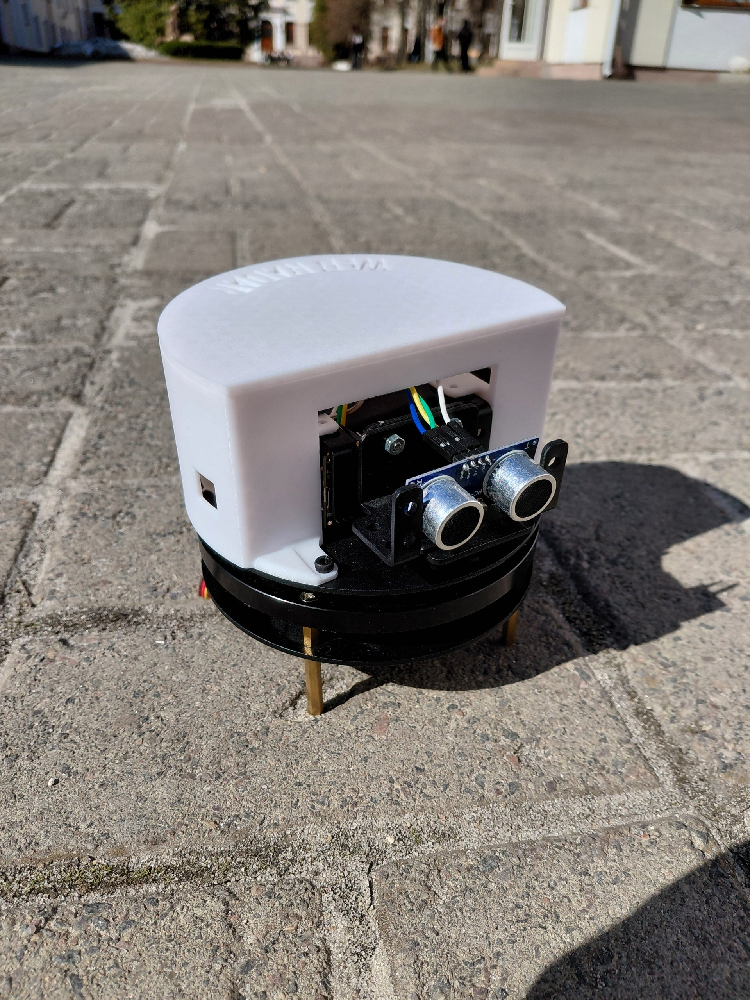
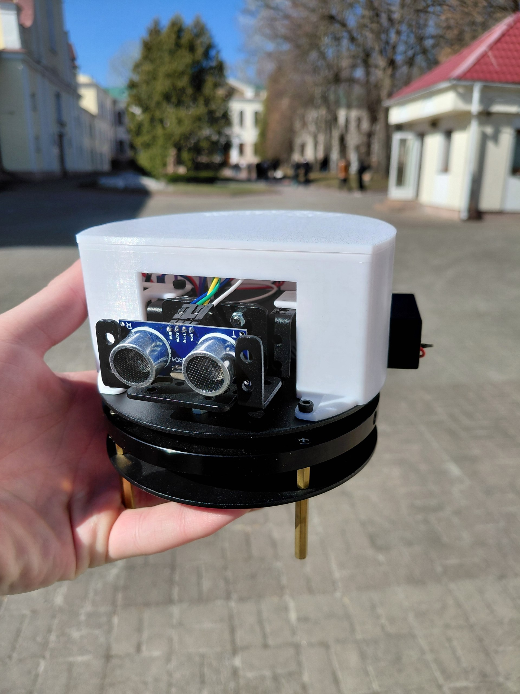
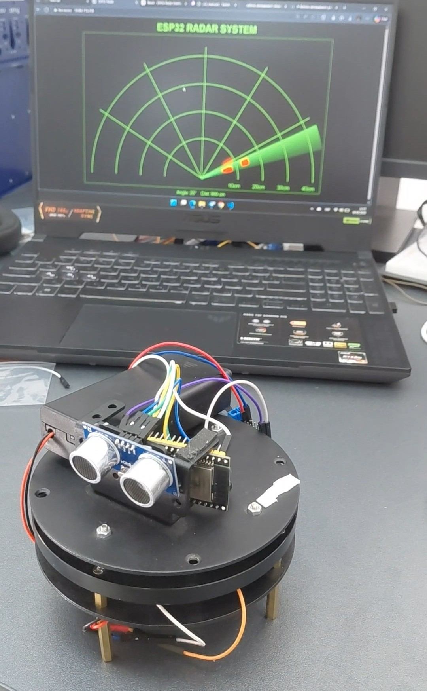
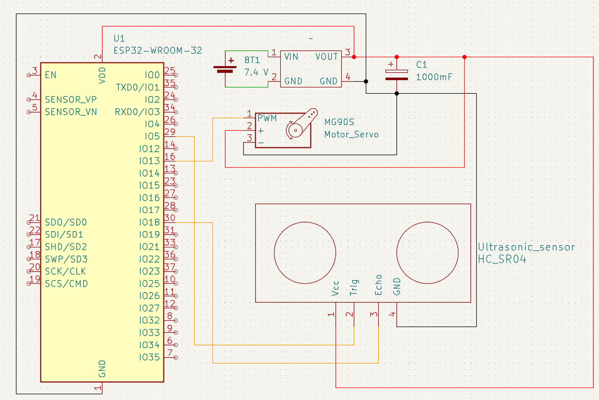
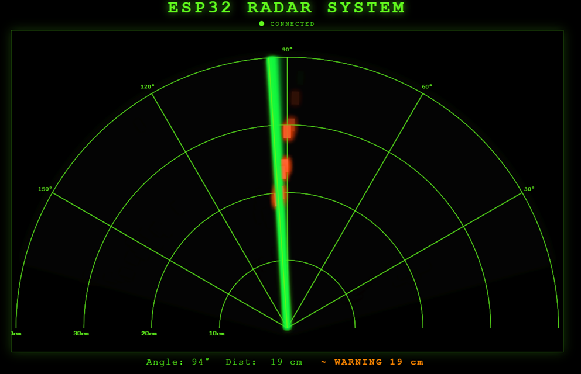
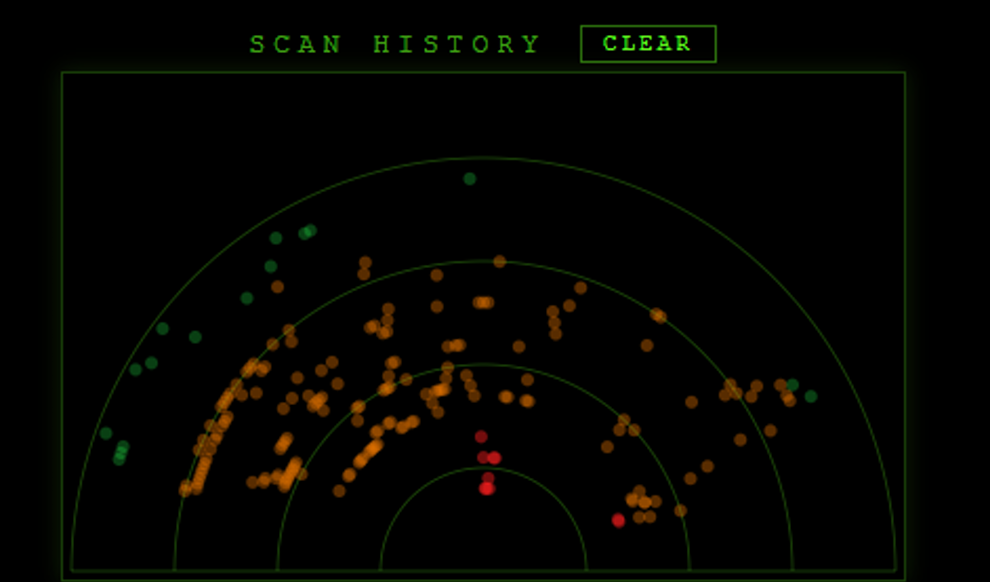
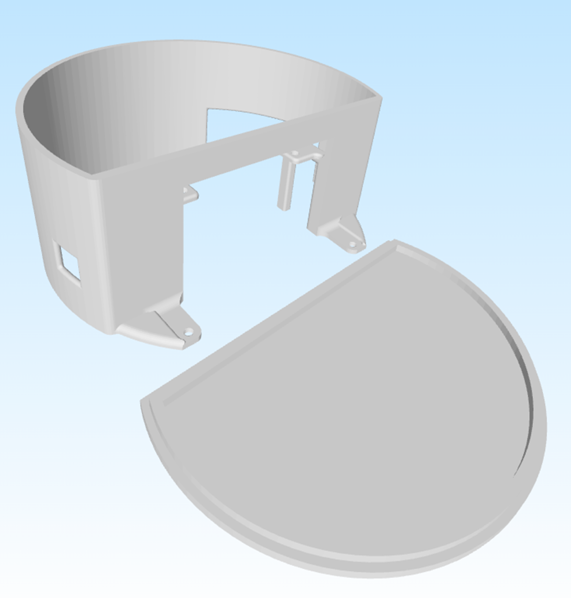

# ESP32 Web Radar System

Веб-радар на базі ESP32, ультразвукового датчика HC-SR04 та сервомотора.
Браузер підключається через WebSocket і отримує дані в реальному часі — без жодного встановлення програм.

---

## Зміст

1. [Апаратна частина](#1-апаратна-частина)
2. [Архітектура системи](#2-архітектура-системи)
3. [WiFi: точка доступу та підключення до роутера](#3-wifi-точка-доступу-та-підключення-до-роутера)
4. [Вимірювання відстані: від pulseIn до ISR](#4-вимірювання-відстані-від-pulsein-до-isr)
5. [Медіанний фільтр: усунення хибних спрацювань](#5-медіанний-фільтр-усунення-хибних-спрацювань)
6. [Сканування: таймінг сервомотора](#6-сканування-таймінг-сервомотора)
7. [WebSocket: протокол і broadcast](#7-websocket-протокол-і-broadcast)
8. [Три зони виявлення](#8-три-зони-виявлення)
9. [Веб-інтерфейс: canvas і анімація](#9-веб-інтерфейс-canvas-і-анімація)
10. [Адаптивний дизайн](#10-адаптивний-дизайн)
11. [Відстеження руху об'єктів](#11-відстеження-руху-обєктів)
12. [Теплова карта виявлень](#12-теплова-карта-виявлень)
13. [Залежності та збірка](#13-залежності-та-збірка)

---

## 1. Апаратна частина

### Компоненти

| Компонент | Призначення |
|---|---|
| ESP32 DoIt DevKit v1 | Мікроконтролер: WiFi, сервер, сканування |
| HC-SR04 | Ультразвуковий датчик відстані |
| Servo SG90 / MG90S | Обертання датчика |

### Схема підключення

```
ESP32 GPIO 5  → TRIG  (HC-SR04)
ESP32 GPIO 18 → ECHO  (HC-SR04)
ESP32 GPIO 13 → Signal (Servo)
3.3 V / 5 V   → VCC
GND           → GND
```

```cpp
static const int trigPin  = 5;
static const int echoPin  = 18;
static const int servoPin = 13;
```

Сервомотор сканує в діапазоні **15° – 165°** (150° робочий сектор).
Кроки менше 15° і більше 165° обмежені механічно для запобігання пошкодженню.

```cpp
static const int angleMin = 15;
static const int angleMax = 165;
```

---

## 2. Архітектура системи

```
┌──────────────────────────────────────────┐
│               ESP32                      │
│                                          │
│  loop()                                  │
│   ├─ крок сервомотора (65 мс)            │
│   ├─ стабілізація (45 мс)                │
│   ├─ measureFiltered() → 3 виміри ISR    │
│   └─ sendRadar() → ws.textAll() ─────────┼──► браузер 1
│                              └───────────┼──► браузер 2
│  AsyncWebServer (порт 80)                │
│   ├─ GET /          → index.html         │
│   └─ GET /style.css → style.css          │
│                                          │
│  LittleFS: index.html, style.css         │
└──────────────────────────────────────────┘
```

ESP32 працює одночасно у двох WiFi-режимах:
- **AP (Access Point)** — власна мережа `KLEBAN_RADAR`, завжди доступна
- **STA (Station)** — підключення до домашнього роутера для доступу з основної мережі

---

## 3. WiFi: точка доступу та підключення до роутера

### Режим AP+STA

```cpp
WiFi.mode(WIFI_AP_STA);
WiFi.setSleep(false);   // вимикає енергозбереження — важливо для стабільності WebSocket
WiFi.softAP(AP_SSID, AP_PASS);
startSta();             // паралельно починаємо підключення до роутера
```

### Виправлення: автоматичний канал AP

**Проблема.** Спочатку канал AP був захардкоджений: `WiFi.softAP(AP_SSID, AP_PASS, 8)`.
ESP32 не може одночасно тримати AP і STA на різних WiFi-каналах.
Якщо роутер переключиться з каналу 8 на інший — STA-підключення падає
або точка доступу стає недоступною.

**Рішення.** Параметр каналу прибрано:

```cpp
// Було:
WiFi.softAP(AP_SSID, AP_PASS, 8);  // жорстко канал 8

// Стало:
WiFi.softAP(AP_SSID, AP_PASS);     // канал узгоджується автоматично
```

ESP32 автоматично встановить для AP той самий канал, що й STA-з'єднання
після підключення до роутера.

### Повторне підключення STA

При відсутності роутера або таймауті (15 с) — повтор через 30 с:

```cpp
static void updateStaConnect() {
    uint32_t now = millis();
    if (staConnecting) {
        if (WiFi.status() == WL_CONNECTED) {
            staConnecting = false;
            return;
        }
        if (now - staStartMs > 15000) {      // таймаут 15 с
            staConnecting = false;
            staRetryMs    = now;
        }
        return;
    }
    if (WiFi.status() == WL_CONNECTED) return;
    if (now - staRetryMs >= 30000) startSta(); // повтор через 30 с
}
```

### Виправлення: delay(100) у setup()

У `startWifi()` є виклик `delay(100)` — це єдиний `delay()` у всій прошивці.
Він потрібен для гарантованого скидання WiFi-стека після `WiFi.disconnect()`.

```cpp
static void startWifi() {
    WiFi.disconnect(true, true);
    // Коротка затримка для гарантованого скидання WiFi-стека ESP32.
    // Знаходиться в setup(), тому не блокує основний робочий цикл loop().
    delay(100);
    ...
}
```

У `loop()` немає жодного `delay()` — весь код неблокуючий.

---

## 4. Вимірювання відстані: від pulseIn до ISR

### Як працює HC-SR04

1. Подати HIGH на TRIG протягом 10 мкс
2. Датчик надсилає 8 ультразвукових імпульсів на 40 кГц
3. Пін ECHO стає HIGH на час польоту звуку туди і назад
4. Відстань: `d = (тривалість_ехо × 0.0343) / 2`

```
TRIG: _____|10мкс|_______________________________
ECHO: ____________|←── час польоту ──→|__________
```

### Чому pulseIn() — погано

Стандартна функція `pulseIn()` **повністю блокує ЦП** поки чекає ехо:

```cpp
// Стара версія — блокує до 6 мс при кожному вимірі
uint32_t dur = pulseIn(echoPin, HIGH, pulseTimeoutUs);
```

ESP32 паралельно обслуговує WiFi-стек, AsyncTCP і WebSocket.
Блокування навіть на 6 мс може спричинити:
- мікро-затримки передачі WebSocket-пакетів
- нестабільність TCP-з'єднання при частому скануванні

### Рішення: апаратне переривання (ISR)

ISR підключається до піна ECHO з типом `CHANGE` — спрацьовує на **обидва** фронти:

```cpp
volatile uint32_t echoStartUs   = 0;
volatile uint32_t echoDurUs     = 0;
volatile bool     echoReady     = false;
volatile bool     echoMeasuring = false;

void IRAM_ATTR echoISR() {
    if (digitalRead(echoPin) == HIGH) {
        echoStartUs   = micros();   // передній фронт → старт таймера
        echoMeasuring = true;
        echoReady     = false;
    } else if (echoMeasuring) {
        echoDurUs   = micros() - echoStartUs;  // задній фронт → тривалість
        echoReady   = true;
        echoMeasuring = false;
    }
}
```

> `IRAM_ATTR` — обов'язковий атрибут для функцій переривань на ESP32:
> гарантує розміщення коду ISR у IRAM (внутрішня RAM),
> де він виконується навіть коли зовнішній flash заблокований.

Підключення в `setup()`:
```cpp
attachInterrupt(digitalPinToInterrupt(echoPin), echoISR, CHANGE);
```

Тригерний імпульс — звичайний:
```cpp
static void triggerPulse() {
    echoReady     = false;
    echoMeasuring = false;
    digitalWrite(trigPin, LOW);
    delayMicroseconds(2);
    digitalWrite(trigPin, HIGH);
    delayMicroseconds(10);   // 10 мкс HIGH → датчик отримав команду
    digitalWrite(trigPin, LOW);
}
```

Очікування результату через `yield()` замість busy-wait:

```cpp
static int readEchoCm() {
    uint32_t deadline = micros() + pulseTimeoutUs + 500;
    while (!echoReady) {
        if (micros() > deadline) return 999; // таймаут → об'єкт відсутній
        yield();  // ← передаємо керування FreeRTOS, не блокуємо планувальник
    }
    uint32_t dur = echoDurUs;
    if (dur == 0 || dur > pulseTimeoutUs) return 999;
    return (int)lroundf((dur * soundCmPerUs) / 2.0f);
}
```

`yield()` викликає `vTaskDelay(0)` — ядро FreeRTOS отримує слот для виконання
WiFi/TCP задач. На відміну від `pulseIn()`, процесор не заблокований.

---

## 5. Медіанний фільтр: усунення хибних спрацювань

### Проблема HC-SR04

Датчик дає хибні значення у кількох ситуаціях:

| Причина | Ефект |
|---|---|
| Поверхня під кутом >15° | Відбиття йде мимо приймача, dur=0 → 999 |
| Вібрація від сервомотора | Розмитий фронт ECHO → хибна тривалість |
| Акустичні завади | Чужий ультразвук → передчасний задній фронт |

Один хибний вимір із 999 замість реальних 20 см призводить до
миттєвого "зникнення" об'єкта і мерехтіння детекції на радарі.

### Медіанний фільтр з трьох вимірів

```cpp
static int measureFiltered() {
    int s[3];
    for (int i = 0; i < 3; i++) {
        triggerPulse();
        s[i] = readEchoCm();
        if (i < 2) delayMicroseconds(300); // пауза між імпульсами:
                                            // відлуння першого не заважає другому
    }
    // Сортувальна мережа для 3 елементів (мінімум операцій: 3 порівняння)
    if (s[0] > s[1]) { int t = s[0]; s[0] = s[1]; s[1] = t; }
    if (s[1] > s[2]) { int t = s[1]; s[1] = s[2]; s[2] = t; }
    if (s[0] > s[1]) { int t = s[0]; s[0] = s[1]; s[1] = t; }
    return s[1];  // медіана — середнє значення після сортування
}
```

**Чому медіана, а не середнє?**
Якщо виміри: `[22, 999, 23]` → середнє = 348 (хибне), медіана = 23 (вірне).
Медіана повністю ігнорує викиди, середнє — ні.

**Час виконання:** 3 × (10 мкс тригер + до 6000 мкс ехо) + 2 × 300 мкс ≤ **18 мс**.
Вміщується в 45 мс `servoSettleMs` (час стабілізації сервомотора після кроку).

---

## 6. Сканування: таймінг сервомотора

Сканування — неблокуюча кінцева машина стану:

```
loop iteration N:
  !waitingSettle && elapsed ≥ servoStepPeriodMs
    → move servo +1° / -1°
    → waitingSettle = true

loop iteration N+K:
  waitingSettle && elapsed ≥ servoSettleMs
    → measureFiltered()   (~18 мс)
    → sendRadar()
    → waitingSettle = false
```

```cpp
// Крок сервомотора
if (!waitingSettle && (now - lastServoStepMs >= servoStepPeriodMs)) {
    lastServoStepMs = now;

    if (currentAngle >= angleMax) scanDir = -1;  // реверс на 165°
    if (currentAngle <= angleMin) scanDir = +1;  // реверс на 15°
    currentAngle += scanDir;

    servoMotor.write(currentAngle);
    movedAtMs     = now;
    waitingSettle = true;
}

// Вимір після стабілізації
if (waitingSettle && (now - movedAtMs >= servoSettleMs)) {
    waitingSettle = false;
    int dist = measureFiltered();
    sendRadar(currentAngle, dist, scanDir, movedAtMs);
}
```

### Таймінг

```
servoStepPeriodMs = 65 мс   (крок → крок)
servoSettleMs     = 45 мс   (чекаємо стабілізації перед виміром)
3 виміри          ≤ 18 мс   (медіанний фільтр)
─────────────────────────
Ефективний крок  ≈ 63 мс   → ~15.8 кроків/с → повна розгортка ~9.5 с
```

> Раніше `servoStepPeriodMs = 50 мс`, але після додавання медіанного фільтра
> (3 виміри ≤ 18 мс) крок збільшено до 65 мс щоб таймінг залишався передбачуваним.
> Значення `STEP_MS = 65` у `index.html` синхронізовано.

---

## 7. WebSocket: протокол і broadcast

### JSON-пакет

При кожному вимірі ESP32 надсилає один JSON-пакет:

```json
{"a":90,"d":27,"dir":1,"t":12345,"z":1}
```

| Поле | Тип | Опис |
|---|---|---|
| `a` | int | Поточний кут сервомотора (°) |
| `d` | int | Відстань до об'єкта (см), 999 = відсутній |
| `dir` | int | Напрямок: +1 (15°→165°) або -1 (165°→15°) |
| `t` | uint32 | `millis()` в момент вимірювання (мс) |
| `z` | int | Зона: 0 безпечно, 1 попередження, 2 критично |

### Виправлення: broadcast замість одного клієнта

**Проблема.** Спочатку дані отримував лише один браузер:

```cpp
// Стара версія — тільки "останній підключений"
static AsyncWebSocketClient* activeClient = nullptr;

ws.onEvent([](AsyncWebSocket*, AsyncWebSocketClient* client, ...) {
    if (type == WS_EVT_CONNECT) activeClient = client; // ← перезаписується!
    if (type == WS_EVT_DISCONNECT)
        if (activeClient->id() == client->id()) activeClient = nullptr;
});

static void sendRadar(...) {
    AsyncWebSocketClient* c = activeClient;
    if (!c || c->status() != WS_CONNECTED) return;
    c->text(msg, n);  // ← тільки один клієнт
}
```

При підключенні другого браузера — перший переставав отримувати дані.

**Рішення.** `ws.textAll()` — broadcast до всіх активних клієнтів:

```cpp
// Нова версія — broadcast
static void sendRadar(int angle, int distCm, int dir, uint32_t tms) {
    if (ws.count() == 0) return;  // нікого немає → пропустити

    int zone = (distCm >= 999)             ? 0 :
               (distCm < ZONE_CRITICAL_CM) ? 2 :
               (distCm < ZONE_WARNING_CM)  ? 1 : 0;

    char msg[80];
    int n = snprintf(msg, sizeof(msg),
                     "{\"a\":%d,\"d\":%d,\"dir\":%d,\"t\":%u,\"z\":%d}",
                     angle, distCm, dir, (unsigned)tms, zone);
    if (n > 0 && n < (int)sizeof(msg))
        ws.textAll(msg, (size_t)n);  // ← всі клієнти одночасно
}
```

Обробник подій спростився — `activeClient` більше не потрібен:

```cpp
ws.onEvent([](AsyncWebSocket*, AsyncWebSocketClient* client,
              AwsEventType type, void*, uint8_t*, size_t) {
    if (type == WS_EVT_CONNECT) {
        Serial.printf("[WS] Connect id=%u  ip=%s  total=%u\n",
                      client->id(),
                      client->remoteIP().toString().c_str(),
                      ws.count());
        client->client()->setNoDelay(true);  // Nagle OFF → менша латентність
    }
    if (type == WS_EVT_DISCONNECT)
        Serial.printf("[WS] Disconnect id=%u  total=%u\n",
                      client->id(), ws.count());
});
```

---

## 8. Три зони виявлення

Замість одного порогу — три зони з різними рівнями тривоги.

### Прошивка

```cpp
static const int ZONE_CRITICAL_CM = 15;  // зона 2 — червона
static const int ZONE_WARNING_CM  = 35;  // зона 1 — помаранчева
// > 35 см або 999                        // зона 0 — зелена / немає об'єкта
```

Зона обчислюється безпосередньо перед відправкою:

```cpp
int zone = (distCm >= 999)             ? 0 :   // немає відлуння
           (distCm < ZONE_CRITICAL_CM) ? 2 :   // < 15 см → критично
           (distCm < ZONE_WARNING_CM)  ? 1 : 0; // < 35 см → попередження
```

Логування за зонами у Serial Monitor:
```
[!!] CRITICAL  angle= 90  dist=  8 cm
[~]  WARNING   angle= 75  dist= 28 cm
[RADAR] ang=45 dir=+1 dist=45cm clients=2 sta=192.168.1.105
```

### Веб-інтерфейс

Браузер отримує поле `z` і застосовує кольорову схему:

```js
const ZONE_CRITICAL_CM = 15;
const ZONE_WARNING_CM  = 35;

// Зворотна сумісність: якщо стара прошивка без поля z — обчислюємо самостійно
const z = data.z ?? (d >= 999 ? 0 : d < ZONE_CRITICAL_CM ? 2 : d < ZONE_WARNING_CM ? 1 : 0);
```

Відображення детекцій:

```js
const color = z === 2 ? "#ff2222" : z === 1 ? "#ff6633" : "#62f51f";
const glow  = z === 2 ? "#ff0000" : z === 1 ? "#ff4400" : "#40dd00";
const lw    = z === 2 ? 22        : z === 1 ? 16        : 12;

ctx.strokeStyle = color;
ctx.lineWidth   = lw;
ctx.shadowColor = glow;
ctx.shadowBlur  = 12;
```

### Виправлення: alert завжди очищується

**Проблема.** Попередження `alertEl` оновлювалось тільки при виявленні об'єкта
у зоні `MAX_DIST_CM`. Якщо об'єкт зникав і датчик повертав 999 — умова
`d < MAX_DIST_CM` ставала хибною, блок не виконувався, попередження "зависало":

```js
// Стара версія — alert не очищується при зникненні об'єкта
if (d > 0 && d < MAX_DIST_CM) {
    if (d < OBSTACLE_CM) {
        alertEl.textContent = `⚠ OBSTACLE at ${d} cm`;
    }
    // якщо d ≥ OBSTACLE_CM але < MAX_DIST_CM — теж нічого не очищується
}
// якщо d = 999 → цей блок взагалі не виконується → alert лишається!
```

**Рішення.** Оновлення `alertEl` перенесено за межі умовного блоку
і виконується при **кожному** пакеті:

```js
// Нова версія — оновлюємо alert завжди, незалежно від відстані
if (z === 2) {
    alertEl.textContent = `!! CRITICAL  ${d} cm`;
    alertEl.style.color = "#ff2222";
} else if (z === 1) {
    alertEl.textContent = `~  WARNING   ${d} cm`;
    alertEl.style.color = "#ff8800";
} else {
    alertEl.textContent = "";  // ← порожньо → CSS вимикає мерехтіння
}
```

CSS автоматично вимикає анімацію при порожньому елементі:

```css
#alert-box:empty {
    animation: none;  /* не мерехтить коли загрози немає */
}
```

---

## 9. Веб-інтерфейс: canvas і анімація

### Синхронізація часу (EWMA)

ESP32 надсилає `millis()` у полі `t`. Браузер відстежує різницю між
`performance.now()` (час браузера) та `t` (час ESP32):

```js
const rawOff  = performance.now() - t;
// EWMA: коефіцієнт 0.25 → швидша адаптація при зміні затримки мережі
espToPcOffset = espToPcOffset
    ? espToPcOffset * 0.75 + rawOff * 0.25
    : rawOff;
```

Завдяки синхронізації браузер передбачає поточний кут між пакетами:

```js
function predictedAngle() {
    const estEsp  = performance.now() - espToPcOffset;  // оцінка часу ESP32
    const elapsed = estEsp - espBaseTms;                // скільки мс минуло
    const a = baseAngle + baseDir * (elapsed / STEP_MS); // лінійна екстраполяція
    return Math.max(ANGLE_MIN, Math.min(ANGLE_MAX, a));
}
```

### Плавний промінь (lerp)

```js
function animate() {
    applyLastMsg();

    const target = predictedAngle();
    const diff   = target - displayAngle;

    if (Math.abs(diff) > 8) {
        displayAngle = target;        // миттєвий snap при реверсі (>8°)
    } else {
        displayAngle += diff * 0.35;  // lerp — плавний рух
    }

    drawFrame(displayAngle);
    requestAnimationFrame(animate);
}
```

### WebSocket: exponential backoff при перепідключенні

**Проблема.** При відключенні ESP32 браузер надсилав запит кожні 800 мс нескінченно:

```js
// Стара версія — постійний спам кожні 800 мс
ws.onclose = () => { setTimeout(connectWS, 800); };
```

**Рішення.** Exponential backoff — затримка подвоюється після кожної невдачі:

```js
let reconnectDelay = 800;
const MAX_RECONNECT_MS = 10000;

function connectWS() {
    ws = new WebSocket(gateway);
    ws.onopen = () => {
        statusEl.style.color = "#62f51f";
        reconnectDelay = 800;  // скидаємо після успіху
    };
    ws.onclose = () => {
        statusEl.style.color = "#f00";
        setTimeout(connectWS, reconnectDelay);
        // 800 → 1600 → 3200 → 6400 → 10000 мс (максимум)
        reconnectDelay = Math.min(reconnectDelay * 2, MAX_RECONNECT_MS);
    };
    ws.onmessage = (e) => { lastMsg = e.data; };
}
```

---

## 10. Адаптивний дизайн

### Canvas масштабується під вікно

**Проблема.** Фіксований розмір `<canvas width="1200" height="700">` в HTML
спричиняв горизонтальне прокручування на екранах менше 1200 пікселів.

**Рішення.** `resizeCanvas()` обчислює розмір динамічно і підписується на `resize`:

```js
let CW, CH, MAX_RADIUS, ORIGIN_Y;  // let, не const — перераховуються при resize

function resizeCanvas() {
    const ASPECT = 12 / 7;
    const maxW   = Math.min(window.innerWidth * 0.96, 1200);
    CW = Math.round(maxW);
    CH = Math.round(CW / ASPECT);

    canvas.width  = CW;
    canvas.height = CH;

    ORIGIN_Y   = CH - Math.round(CH * 0.074);  // база радара знизу
    MAX_RADIUS = (CW / 2) - 10;

    // Теплова карта — 1/3 від радара
    hcv.width  = Math.round(CW / 3);
    hcv.height = Math.round(hcv.width * 0.6);
    initHeatmap();
}

window.addEventListener("resize", resizeCanvas);

window.onload = () => {
    resizeCanvas();   // ← викликати до першого drawFrame
    connectWS();
    requestAnimationFrame(animate);
};
```

Усі функції малювання використовують `MAX_RADIUS` і `ORIGIN_Y` в момент виклику —
перемасштабування відбувається автоматично.

### Масштабовані шрифти через clamp()

**Проблема.** Фіксовані розміри шрифтів `font-size: 38px` виглядали нормально
на великому екрані, але були надто великими або надто дрібними на інших.

**Рішення.** CSS `clamp(мінімум, оптимальний_у_vw, максимум)`:

```css
h1 {
    /* 16px на дуже вузьких екранах, 3.5% ширини вікна в середньому,
       не більше 38px на великих моніторах */
    font-size: clamp(16px, 3.5vw, 38px);
}

#info {
    font-size: clamp(12px, 1.8vw, 20px);
    flex-wrap: wrap;   /* переніс блоків на вузьких екранах */
    gap: clamp(12px, 3vw, 32px);
}

#alert-box {
    font-size: clamp(12px, 1.8vw, 20px);
    animation: blink 0.6s step-start infinite;
}

#alert-box:empty {
    animation: none;  /* мерехтіння вимкнено коли загрози немає */
}
```

---

## 11. Відстеження руху об'єктів

Радар здійснює розгортку: 15° → 165° → 15° → … Кожна повна пробіжка —
**один sweep**. Порівнюючи дані двох послідовних sweepів, можна виявити рух.

### Принцип

```
Sweep N-1:  кут 90° → dist = 30 см
Sweep N:    кут 90° → dist = 24 см
Δ = 24 - 30 = -6 см  → об'єкт наблизився на 6 см → стрілка "наближення"
```

### Реалізація

При кожній зміні напрямку `dir` — кінець sweep:

```js
const prevScanDist = new Array(181).fill(null);
const motionState  = new Array(181).fill(0);   // -1 наближ., 0 стат., +1 відд.
const motionHold   = new Array(181).fill(0);   // кадри відображення стрілки

function analyzeMotion() {
    for (let a = ANGLE_MIN; a <= ANGLE_MAX; a++) {
        if (detDist[a] !== null && prevScanDist[a] !== null) {
            const delta = detDist[a] - prevScanDist[a];
            if (Math.abs(delta) > 5) {           // < 5 см — шум датчика
                motionState[a] = delta > 0 ? 1 : -1;
                motionHold[a]  = HOLD_FRAMES * 2; // ~2 с
            }
        }
    }
}

// В applyLastMsg() при зміні напрямку:
if (lastSweepDir !== null && dir !== lastSweepDir) {
    analyzeMotion();
    for (let i = 0; i <= 180; i++) prevScanDist[i] = detDist[i];
}
lastSweepDir = dir;
```

### Малювання стрілок

```js
if (motionState[ang] !== 0 && motionHold[ang] > 0) {
    motionHold[ang]--;
    const mDir  = motionState[ang];          // -1 або +1
    const alpha = Math.min(1, motionHold[ang] / 20);  // згасання

    // Стрілка вздовж радіуса: кінець → початок вказує напрямок
    const [mx1, my1] = toXY(ang, px + mDir * 22);
    const [mx2, my2] = toXY(ang, px - mDir * 8);

    const headLen = 7;
    const headAng = Math.atan2(my2 - my1, mx2 - mx1);

    ctx.strokeStyle = mDir < 0 ? "#ff44ff" : "#44ffff";
    // пурпурний (#ff44ff) → наближення
    // блакитний (#44ffff) → віддалення
    ctx.shadowColor = mDir < 0 ? "#ff00ff" : "#00ffff";

    ctx.beginPath();
    ctx.moveTo(mx1, my1);
    ctx.lineTo(mx2, my2);
    // наконечник стрілки — дві лінії під кутом ±0.4 рад
    ctx.lineTo(mx2 - headLen * Math.cos(headAng - 0.4),
               my2 - headLen * Math.sin(headAng - 0.4));
    ctx.moveTo(mx2, my2);
    ctx.lineTo(mx2 - headLen * Math.cos(headAng + 0.4),
               my2 - headLen * Math.sin(headAng + 0.4));
    ctx.stroke();
}
```

---

## 12. Теплова карта виявлень

Основний радар показує детекції максимум 1 секунду (HOLD_FRAMES = 60 кадрів).
Теплова карта — окремий `<canvas>` — **накопичує всі виявлення за сесію**.

### Призначення

Накопичена карта показує "гарячі зони" — місця де об'єкти фіксуються
найчастіше. Це неможливо побачити на основному радарі через короткочасні детекції.

### Ініціалізація сітки

```js
function initHeatmap() {
    const HW = hcv.width, HH = hcv.height;
    const HR = (HW / 2) - 4;
    const HOY = HH - 4;

    hctx.fillStyle = "#000";
    hctx.fillRect(0, 0, HW, HH);

    hctx.strokeStyle = "rgba(98,245,31,0.3)";
    for (let d = 10; d <= MAX_DIST_CM; d += 10) {
        const r = d * (HR / MAX_DIST_CM);
        hctx.beginPath();
        hctx.arc(HW / 2, HOY, r, Math.PI, 2 * Math.PI);
        hctx.stroke();
    }
}
```

### Додавання точки

```js
function addHeatmapPoint(ang, dist, zone) {
    const HW  = hcv.width, HH = hcv.height;
    const HR  = (HW / 2) - 4;
    const HOY = HH - 4;
    const r   = dist * (HR / MAX_DIST_CM);
    const rad = ang * Math.PI / 180;
    const x   = HW / 2 + r * Math.cos(rad);
    const y   = HOY    - r * Math.sin(rad);

    hctx.beginPath();
    hctx.arc(x, y, 3, 0, 2 * Math.PI);
    // Колір відповідає зоні, прозорість часткова → точки накладаються
    hctx.fillStyle = zone === 2 ? "rgba(255,30,30,0.45)"  :  // критична
                     zone === 1 ? "rgba(255,130,0,0.35)"  :  // попередження
                                  "rgba(40,255,80,0.25)";    // безпечна
    hctx.fill();
}
```

Функція викликається при кожному виявленні з `applyLastMsg()`:

```js
if (d > 0 && d < MAX_DIST_CM) {
    const ang = Math.max(0, Math.min(180, Math.round(a)));
    detDist[ang]  = d;
    detHold[ang]  = HOLD_FRAMES;
    detAlpha[ang] = 1.0;
    detZone[ang]  = z;
    addHeatmapPoint(ang, d, z);  // ← теплова карта
}
```

Кнопка CLEAR:

```js
document.getElementById("clearHeatmap").addEventListener("click", () => {
    initHeatmap();  // очищення + перемальовка сітки
});
```

---

## 13. Візуальні матеріали

### Фото прототипу







### Схема, інтерфейс і корпус









## 14. Залежності та збірка

### platformio.ini

```ini
[env:esp32doit-devkit-v1]
platform       = espressif32
board          = esp32doit-devkit-v1
framework      = arduino
monitor_speed  = 115200
board_build.filesystem = littlefs

lib_deps =
    esphome/ESPAsyncWebServer-esphome @ ^3.1.0
    madhephaestus/ESP32Servo          @ ^3.0.5
```

### Збірка і завантаження

```bash
# Збірка прошивки
pio run

# Завантаження прошивки
pio run --target upload

# Завантаження файлів веб-інтерфейсу (data/)
pio run --target uploadfs

# Монітор порту
pio device monitor
```

### Файлова структура

```
ESP32-WEB-Radar-System/
├── IMAGES/
│   ├── esp32_radar_assembled_device_front.jpg
│   ├── esp32_radar_live_test_with_web_interface.jpg
│   └── esp32_radar_wiring_schematic.png
├── src/
│   └── main.cpp          # прошивка ESP32
├── data/
│   ├── index.html         # веб-інтерфейс (canvas + WebSocket)
│   └── style.css          # стилі (адаптивні, clamp)
└── platformio.ini
```

### Підключення до радара

1. Увімкнути ESP32
2. Підключитись до WiFi `KLEBAN_RADAR` (пароль `12345678`)
   або до тієї ж мережі що й роутер
3. Відкрити `http://192.168.4.1` (IP точки доступу) або IP з роутера

---

## Зведена таблиця змін

| # | Файл | Зміна |
|---|---|---|
| Випр. 2 | `main.cpp` | `activeClient` → `ws.textAll()`: broadcast до всіх клієнтів |
| Випр. 3 | `main.cpp` | `pulseIn()` → ISR `echoISR()` + `yield()`: без блокування ЦП |
| Випр. 4 | `main.cpp` | `measureFiltered()`: медіана 3 вимірів, усунення хибних спрацювань |
| Випр. 5 | `main.cpp` | Видалено `channel=8` з `softAP()`: автоматичний канал |
| Випр. 6 | `main.cpp` | Коментар до `delay(100)` у `setup()` |
| Випр. 7 | `index.html` | `resizeCanvas()` + `window.resize`: адаптивний canvas |
| Випр. 8 | `index.html` | Exponential backoff: 800→10000 мс при перепідключенні |
| Випр. 10 | `index.html` | Alert оновлюється при кожному пакеті, `z=0` → очищення |
| Ідея 1 | обидва | 3 зони (z=0/1/2): зелений / помаранч. / червоний |
| Ідея 4 | `index.html` | `analyzeMotion()`: стрілки руху між розгортками |
| Ідея 11 | `style.css` | `clamp()` для шрифтів, `flex-wrap`, `:empty { animation: none }` |
| Ідея 13 | `index.html` | `#heatmapCanvas`: накопичувальна теплова карта + кнопка CLEAR |
